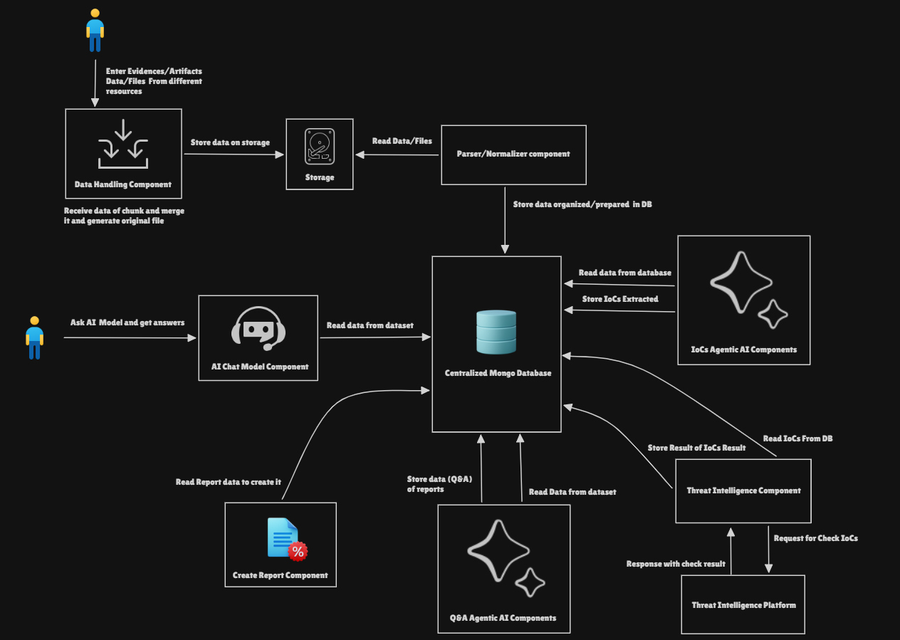

# DFAI
- DFIR ( Digital Forensics Artificial Intelligence )
- Platform for analyze different sources location like ( Memory, Disk, etc.. )

# Project Analysis
- Project Consists of four Components:
  - Data handling Component.
  - Question Agentic Component.
  - Reporting Component.
  - Chatbot Component.

# Project Design

